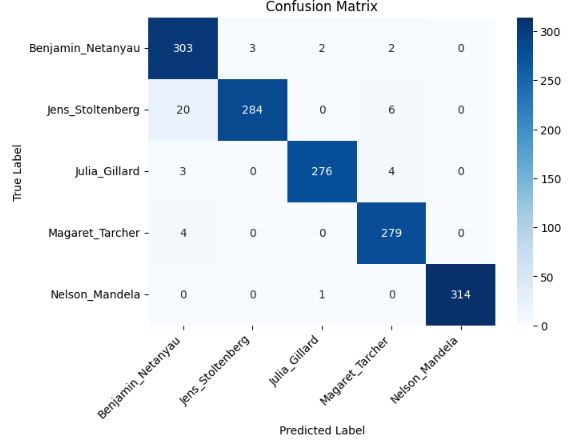

# GMM-based-Speaker-Recognition
## Problem Statement
In this project, we have 1500 1 second wav files for each of the 5 speakers. I try to train a GMM-SVM (Gaussian Mixture Model- Support Vector Machine) model 
to predict if the model captures the speaker properly. There are also background noise files on separate folders if we want to use them and generalize the model further. I have implemented
without using the background noise files. Gaussian Mixture Models (GMMs) are well-suited for certain aspects of speaker recognition due to their ability to model sequential dependencies
and capture temporal patterns in data. The notebook was run on Kaggle, you can also use it on google colab or on jupyter notebook. Just download the speaker-recognition-dataset from Kaggle 
and change the paths for the input. 

## Some Background on Speaker Recognition:

### Objective:

Speaker Recognition: The primary goal of speaker recognition is to identify or verify the identity of a speaker based on their unique vocal characteristics, often referred to as speaker "voiceprints" or "biometric signatures." It is a form of biometric authentication.

### Focus:

Speaker Recognition: Focuses on the unique characteristics of an individual's voice, such as pitch, tone, accent, and speech patterns, to establish the speaker's identity.

### Applications:

Speaker Recognition: Commonly used in security systems, access control, and authentication applications where the identity of the speaker needs to be verified.

### Challenges:

Speaker Recognition: Faces challenges such as variations in voice due to health, emotional state, or environmental conditions. It also needs to account for potential attempts at voice impersonation.

### Techniques:

Speaker Recognition: Uses techniques such as speaker verification (confirming identity) and speaker identification (naming the speaker) based on feature extraction and pattern matching.

### Output:

Speaker Recognition: Outputs the identity or verification result of the speaker.
## Results

The Confusion matrix shows the True Label and Predicted Label for the dataset.

